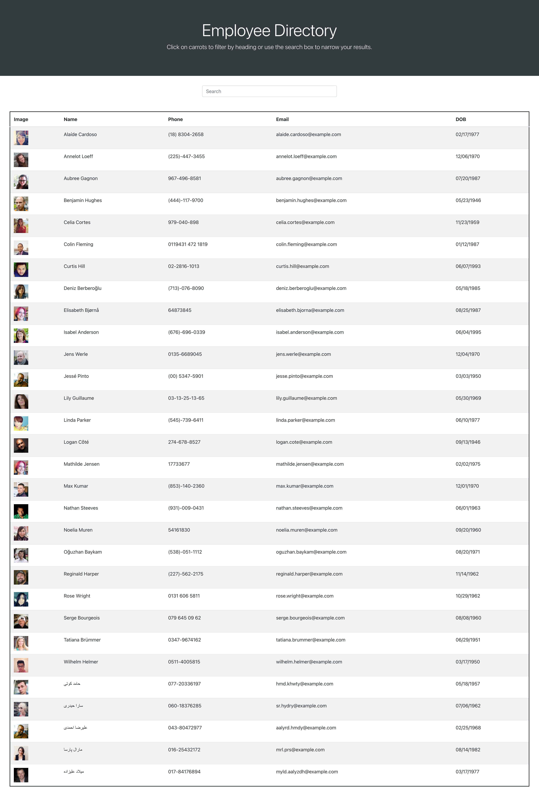

# Employee Directory

## Table of Contents: 
- [Description](#description)
- [Installation](#installation)
- [Contributing](#contributing)
- [Tests](#tests)
- [License](#license)
- [Questions](#questions)
- [Getting-Started-with-Create-React-App](#getting-started-with-create-react-app)

## Description: 
This application utilizes React along with a bootstrap framework and the Random User API, <a href="https://randomuser.me/">https://randomuser.me/</a>, to generate a table of random employees that can be filtered via the search bar or sorted based on Name, Phone Number, Email or Date of Birth. Different portions of the page are split into different functional components per React to improve upon usability and page reload. 

Deployed Project: <a href="https://koltondecker.github.io/Employee-Directory/">https://koltondecker.github.io/Employee-Directory/</a>

Find the source code at <a href="https://github.com/koltondecker/Employee-Directory">https://github.com/koltondecker/Employee-Directory</a>.

<a href="https://www.npmjs.com/package/axios">axios</a> was used for this project.

<a href="https://www.npmjs.com/package/moment">moment</a> was used for this project.

<a href="https://www.npmjs.com/package/react">react</a> was used for this project.

<a href="https://www.npmjs.com/package/jest">jest</a> was used for this project.

### Application Homepage
 

## Installation: 
Upon downloading the files from this repo, use 'npm init' to initialize npm package and 'npm i' to install necessary dependencies for this project.

## Contributing: 
Feel free to contribute to this project in whatever ways you see beneficial. I will review pull requests and update with appropriate additions.

## Tests: 
No tests were used for this project.

### License: 
No license was used for this project. 

### Questions: 

If you would like to learn more, please take a look through my github below:

Visit my GitHub at <a href="https://github.com/koltondecker">github.com/koltondecker</a>

If you still have questions, please send me an email and I will respond as soon as I can:

<a href="mailto:deckerman25@gmail.com">deckerman25@gmail.com</a>

# Getting Started with Create React App

This project was bootstrapped with [Create React App](https://github.com/facebook/create-react-app).

## Available Scripts

In the project directory, you can run:

### `npm start`

Runs the app in the development mode.\
Open [http://localhost:3000](http://localhost:3000) to view it in the browser.

The page will reload if you make edits.\
You will also see any lint errors in the console.

### `npm test`

Launches the test runner in the interactive watch mode.\
See the section about [running tests](https://facebook.github.io/create-react-app/docs/running-tests) for more information.

### `npm run build`

Builds the app for production to the `build` folder.\
It correctly bundles React in production mode and optimizes the build for the best performance.

The build is minified and the filenames include the hashes.\
Your app is ready to be deployed!

See the section about [deployment](https://facebook.github.io/create-react-app/docs/deployment) for more information.

### `npm run eject`

**Note: this is a one-way operation. Once you `eject`, you can’t go back!**

If you aren’t satisfied with the build tool and configuration choices, you can `eject` at any time. This command will remove the single build dependency from your project.

Instead, it will copy all the configuration files and the transitive dependencies (webpack, Babel, ESLint, etc) right into your project so you have full control over them. All of the commands except `eject` will still work, but they will point to the copied scripts so you can tweak them. At this point you’re on your own.

You don’t have to ever use `eject`. The curated feature set is suitable for small and middle deployments, and you shouldn’t feel obligated to use this feature. However we understand that this tool wouldn’t be useful if you couldn’t customize it when you are ready for it.
